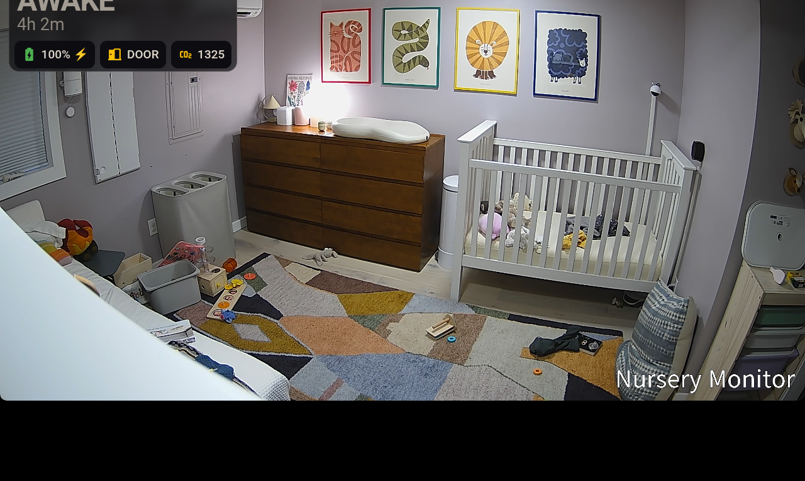
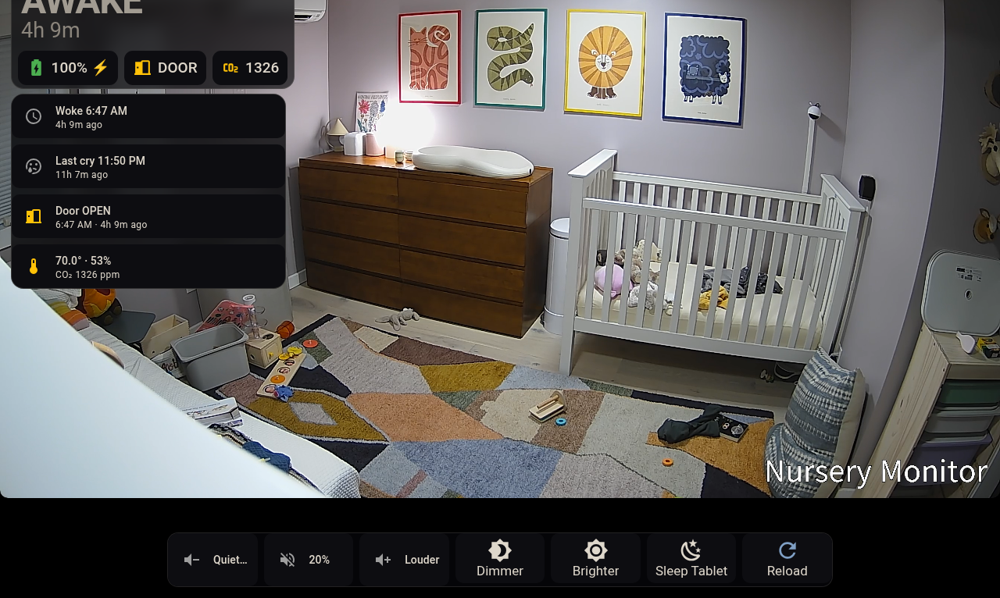

# ha-nursery-monitor

A baby monitor built out of Home Assistant, Frigate, and an inexpensive Android tablet. It
infers whether the child is asleep from the door and a presence sensor, raises a
critical alert when she cries, and wakes the tablet in under a second.
The tablet is free-floating, and is handled the same way as a dumb commodity baby monitor would handle the display.
Locked down and shows only important baby-care information.

Not wall mounting it was deliberate. A parent unit that sits in a bracket is stuck
in whatever room you screwed the bracket into, and the whole point of a parent unit
is that it goes where the parent goes. Mine gets carried to the kitchen, the couch,
or handed to a babysitter for the evening.

It has been running in my house since July 2026.



*Resting state. One line of status, and the rest of the screen is the room.*

*Both screenshots here are cropped to remove identifying information (timestamp,
name, location) for this project. The live dashboard is not cropped all weird.*



*The same screen after a tap. Recent events, climate, and the control bar appear
for twelve seconds and then get out of the way again.*

> **Read [DISCLAIMER.md](DISCLAIMER.md) before you install any of this.** It's
> convenience automation. It is not a breathing monitor, it is not a medical
> device, and nothing here should ever be relied on for a child's wellbeing.

> **An LLM wrote essentially all of this code, and I'm not a software engineer.**
> I steered it, I tested it against my own house, and I threw out what didn't work.
> But I can't vouch for the quality of the code itself and I can't always explain
> how a given piece of it works. See
> [Who wrote this](DISCLAIMER.md#who-wrote-this-and-what-that-means-for-you)
> for the full version, and please read this config before you run it.

## Who wrote this

I want this near the top rather than buried at the bottom, because it should change
how you read everything below it.

An LLM wrote essentially all of the YAML in this repository. I directed the work,
I tested it, and I reversed a fair number of decisions when the data disagreed with
me. What I did not do is write it, and I couldn't have. I'm not a software engineer
and I don't have the background to tell you this config is well built or to audit it
the way somebody who does this professionally would. Ask me why a specific template
renders the way it does and there's a real chance I won't know.

What I can stand behind is the measurement work. The cry qualifier went from 10
seconds to 5 after living with it. The confidence decay got rebuilt from scratch
when a replay against real timestamps showed it would zero out at dawn every
morning. The household-away veto was designed and then thrown away. The WebRTC
audio path got diagnosed by counting three concurrent transcodes, not by guessing.
Every claim in here has a number behind it from a real room with a real child in it.

So: vibe-coded, thoroughly measured. Both are true, the second is the reason to
look at it, and the first is the reason to read it yourself before you run it. If
something in here looks wrong to you, you're probably right, and I'd like to hear
about it.

## What's actually new here

Plenty of people point an IP camera at a crib, and there are good integrations for
getting a Nanit or a CuboAI into Home Assistant. I looked before I published, and I
couldn't find any of these three things packaged anywhere:

**1. A nap state machine that infers sleep from the door and presence.** No
wearable, no mat, no camera-based sleep tracking. It rests on one measurement I
made on my own instance: over 72 hours of door history, the door was *never* closed
and dark outside a sleep window. My wife and I don't close that door unless she's in
there, so a door close isn't a passive condition, it's the artifact of a deliberate
human act.

**2. A dormant-by-default tablet that isn't actually off.** Dormant here means
brightness 0 and volume 0 over a still-playing video element with a black overlay
card on top. The stream never stops. That's the whole reason it wakes instantly
instead of taking three to eight seconds to reconnect, and it's the difference
between something that feels like an OEM monitor and something that feels like a
dashboard.

**3. The audio fix.** If your camera emits AAC, WebRTC can't carry it, so go2rtc
spawns a separate ffmpeg transcode for every single viewer. I measured three
concurrent transcodes and a 2.24 second handshake, which gave me choppy video and
intermittent audio. One persistent `#audio=opus` stream does the transcode once and
shares it. That's five lines and it's probably the most broadly useful thing in
this repo, whether or not you have a baby.

I'm claiming those three things specifically. I'm not claiming a new kind of baby
monitor.

## The measurement the whole design rests on

A sleeping toddler produces **zero** presence events.

One night in July, presence in the nursery cleared at 19:28 and did not fire again
until 06:46 the next morning. Eleven hours and eighteen minutes of silence with a
sleeping child in the room the entire time.

That's what makes the rest work. If presence never fires for the child, then
presence firing means **an adult** walked in, essentially always. Which turns a
noisy sensor into a clean trigger.

I've kept the real numbers in [docs/nap-detection.md](docs/nap-detection.md)
because they're the reason to believe any of this, but I've generalized the dates.
They're a log of when my daughter slept.

### One thing the data caught that I'd have gotten wrong

On a Saturday night, presence fired for 2 minutes 34 seconds with the door closed
from 19:35 straight through to 04:18. Nobody opened that door. 60 GHz mmWave sees
through hollow-core doors, so it most likely caught someone in the hall.

A naive rule of "presence means she's awake" would have flipped her out of `asleep`
at 21:22 on a night when nothing happened. So the entry trigger is the **door-open
event**, not presence. Doors don't open themselves, and presence is only used to
decide when a visit *ends*. That one choice makes the machine immune to radar
bleed-through, and it costs a missed two-minute visit if the door sensor ever drops
an event. A missed visit is a much cheaper error than a phantom wake at bedtime.

## How the state machine works

The nursery is a one-way box. A toddler in a crib behind a closed door can't change
her own occupancy. It only changes when an adult crosses the threshold. So don't try
to sense the child, detect and bound the adult visits.

```
  ANY ──── door OPEN (event) ──────────────► tending
                                               │
                          ┌────────────────────┤
      door open >2 min    │                    │  door CLOSED
      (+ lights on)       │                    │  AND presence clear ≥90s
                          ▼                    ▼
                        awake              settling
                                               │  stable for 5-10 min
                                               ▼
                                            asleep
```

The good part is that a 4am re-settle after a bottle has the identical signature to
a bedtime put-down: presence clears, door closed, dark, sustained. It makes no
difference whether the visit started from `awake` or from `asleep`. Bedtime,
nap-time, and 4am all collapse into one rule.

`sensor.nursery_nap_confidence` decays with elapsed time, because a three-hour-old
"asleep" is worth less than a twenty-minute-old one. The decay is fault detection,
not a model of how long she sleeps. It's there to catch a stuck state machine or a
dead sensor battery, and I had to rebuild it once after setting the caps near the
typical maximum, which fired the decay during ordinary long sleeps and dropped
confidence to near zero exactly when she was most definitely asleep.

## The docs, in the order they're useful

**Start with [docs/nap-detection.md](docs/nap-detection.md), section 0.** It's two
paragraphs, and it tells you whether the rest of this repo applies to your house at
all. The whole design rests on one household habit: *the nursery door gets closed
when, and only when, she's put down*. That makes a door-close a deliberate human
act rather than a passive condition, and everything else is built on top of it. If
your nursery door sits closed all day, or stays open during naps, the state machine
here won't work for you and no amount of sensor tuning will fix it. Better to learn
that in two paragraphs than after buying hardware.

If that assumption holds for you, read in this order:

| | Doc | What it gives you |
|---|---|---|
| 1 | [docs/nap-detection.md](docs/nap-detection.md) | The state machine and the measurements behind it. The core of the project. |
| 2 | [frigate/README.md](frigate/README.md) | Camera and cry detection. Do this before the tablet, which displays a stream that has to exist first. |
| 3 | [docs/tablet-build.md](docs/tablet-build.md) | The parent unit: wake paths, kiosk setup, and the audio traps that cost me the most time. |
| 4 | [docs/wall-remote.md](docs/wall-remote.md) | Optional. A Z-Wave remote that declares ground truth so you can score the inference against reality. |

Then [Setup](#setup) below for the actual install steps.

**Skip these unless you're curious.** [docs/build-journal/](docs/build-journal/) is
the stream of construction: superseded briefs, options I weighed and dropped, and
notes written to myself with task IDs from my own kanban board. One of them specs
hardware that was never built. They're published because the reasoning is sometimes
useful and because a repo that only shows the answer teaches nothing. They are not
instructions.

## What you need

| | |
|---|---|
| Door contact sensor | on the nursery door. Any protocol. |
| mmWave or PIR presence sensor | in the nursery |
| Camera with audio | mine is an EmpireTech IPC-T54IR-ZE-S3. AAC 16 kHz mono is what matters, see below |
| Frigate | for the audio cry detection |
| A tablet | optional. Without one you still get the nap machine and phone alerts |
| Lux sensor | optional, used only as a veto |

The tablet half needs Fully Kiosk Browser plus these from HACS: `browser_mod`,
`card-mod`, `advanced-camera-card`, `bubble-card`.

## Setup

1. Copy `packages/` into your `config/packages/` directory and add this to
   `configuration.yaml` if it isn't there already:

   ```yaml
   homeassistant:
     packages: !include_dir_named packages
   ```

2. Create a notify group called `parents` pointing at whichever phones should get
   alerts. Every notification in the package targets `notify.parents` and nothing
   else:

   ```yaml
   notify:
     - platform: group
       name: parents
       services:
         - service: mobile_app_your_phone
         - service: mobile_app_her_phone
   ```

3. Replace the placeholder entity IDs with your own. Grep the packages for these:

   | Placeholder | What it is |
   |---|---|
   | `binary_sensor.nursery_door_open` | your door contact |
   | `binary_sensor.nursery_presence_sensor` | your presence sensor |
   | `sensor.nursery_light_level_smoothed` | your lux sensor, smoothed |
   | `binary_sensor.nursery_person_occupancy` | Frigate person detection |
   | `binary_sensor.nursery_crib_baby_occupancy` | Frigate crib zone |
   | `<TABLET_IP>`, `<YOUR_BROWSER_ID>`, `<YOUR_DEVICE_ID>` | tablet specifics |

4. Restart Home Assistant. `binary_sensor.nursery_nap` should appear.

5. For the camera and cry detection, see [frigate/README.md](frigate/README.md).

6. For the tablet, see [docs/tablet-build.md](docs/tablet-build.md). Copy
   `themes/nursery_monitor.yaml` into `config/themes/` and paste
   `dashboards/nursery-monitor.yaml` into a new dashboard's raw config editor.

**Run it in shadow mode for a couple of weeks before you trust it.** Two of the wall
remote's holds declare ground truth (`asleep` / `awake`) into a separate helper that
deliberately doesn't touch the inferred state, so you can actually score the machine
against what really happened instead of assuming it works.

## Every tunable is a helper

Nothing you'll want to change at 3am requires a YAML edit and a reload.

| Helper | Mine | What it does |
|---|---|---|
| `nursery_cry_qualify_seconds` | 5 | how long a cry must persist before alerting |
| `nursery_alert_cooldown_minutes` | 3 | minimum gap between alerts |
| `nursery_wake_window` | | expected awake stretch |
| `nursery_monitor_brightness_day` / `_night` | | so a 3am wake isn't blinding |
| `nursery_cry_snooze_minutes` | | snooze from the notification itself |

The cry qualifier started at 10 seconds. I cut it to 5 after living with it, because
10 was slower than a parent already halfway up the stairs.

## What I deliberately left out

**The load-cell crib sensor.** I designed it, priced the BOM, and wrote a build
guide. Then the software approach shipped and turned out to be enough, so the
hardware was never built. That brief is still in the build journal, clearly marked
as unbuilt, because the reasoning about which signals are useless holds up. Do not
build from its BOM — nobody has ever assembled it, and a build guide nobody has
followed is a good way to burn the first person who tries.

**The household-away veto.** The idea was to suppress nap detection when nobody's
home. I rejected it: a sitter puts her down exactly the same way, and this veto
would have woken her. Every error in this system is judged by one question, does it
wake the child.

**`Nursery Hub Buttons`.** That automation is a blueprint instance driving room
lights from a Z-Wave WallMote. It's household light control, not part of the
monitor, and it's the only thing in the original config that carried opaque device
IDs. See [docs/wall-remote.md](docs/wall-remote.md) if you want to wire your own.

## License

MIT. See [LICENSE](LICENSE).
